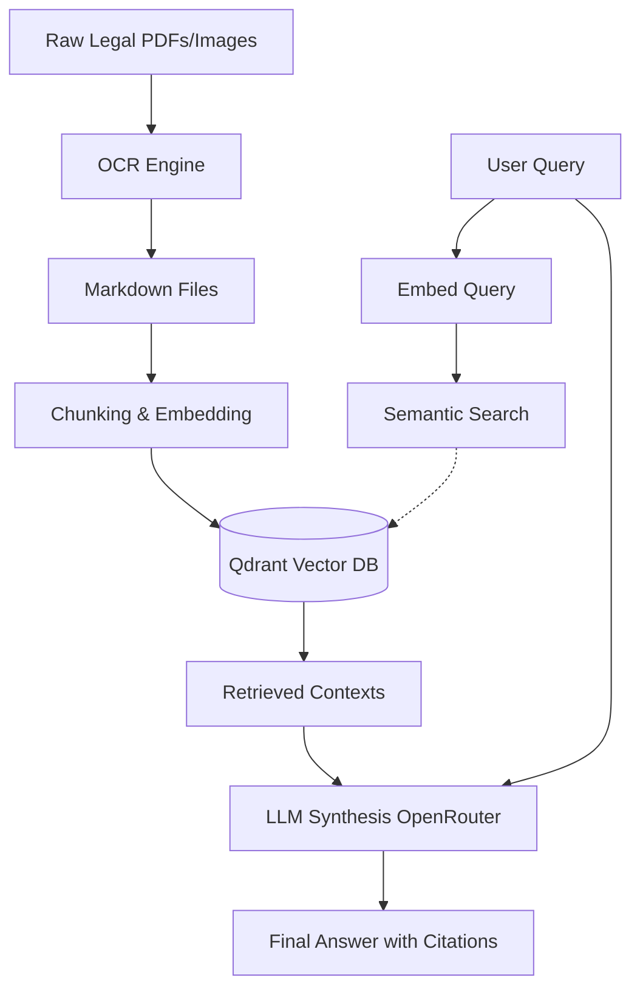

# Architecture: Moroccan LegalTech B2B SaaS

This document outlines the architecture of the legal data ingestion pipeline and RAG (Retrieval-Augmented Generation) system.

## 1. Phase 1: Ingestion & OCR Pipeline
The first phase handles the extraction of text from raw legal documents (PDFs or images). MBZUAI/AIN model 
- **Engine**: Uses a specialized layout-aware OCR engine (capable of processing Arabic RTL text).
- **Structure Preservation**: Identifies legal headers, numbered lists, and tables without character corruption.
- **Output**: Generates clean, structured Markdown files stored initially in `data/pending_review/`.
- **Review**: Once verified, the documents are moved to `data/approved_data/` for indexing.

## 2. Phase 2: Indexing & Vector Database
The second phase prepares the data for semantic search.
- **Chunking**: The Markdown files are parsed and chunked logically (e.g., by Chapter and Article).
- **Embedding**: The text is converted into dense vector embeddings using the `BAAI/bge-m3` model via the Hugging Face API.
- **Storage**: The vectors, along with payload metadata (source file, chapter, article context), are stored in a local **Qdrant** vector database.

## 3. Phase 3: Semantic Search & RAG UI
The third phase is the user-facing application built with Streamlit.
- **Semantic Retrieval**: The user's query is embedded and compared against the Qdrant database to retrieve the top-k most relevant legal contexts.
- **LLM Integration (The Brain)**: The retrieved contexts and the user's query are sent to an LLM via the **OpenRouter API**. The LLM synthesizes the extracted legal texts to provide a direct, accurate, and easy-to-understand answer in Arabic or French.
- **User Interface**: The answer is streamed back to a modern web interface with RTL support, along with the source citations so the user can verify the legal articles themselves.

## Flow Diagram

